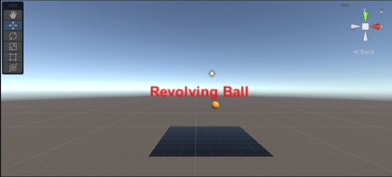

# Rotating-the-Gaming-Object

## Aim:
To develop a 3D application for rotating the gaming objects in unity.
## Algorithm:
### Step 1:
Click File -> Scene -> Select the scene -> Save as-> New folder(Scenes)-> File name (Expno1)
### Step 2:
Click Hierarchy -> 3DObject -> Cylinder
Hierarchy -> 3DObject -> Capsule
Hierarchy -> 3DObject -> Text
Hierarchy -> Effects -> Particle system
### Step 3:
Create a folder in project and name as Materials
Material folder -> Create -> Material (Name: Cylinder)
Inspector ->Surface Inputs ->BaseMAp (Choose the color)
Drag the Cylinder to the plane and release the mouse
Create a folder in project and name as Materials
Material folder -> Create -> Material (Name: Capsule)
Inspector ->Surface Inputs ->BaseMAp (Choose the color)
Drag the Capsule to the plane and release the mouse
### Step 4:
Click Hierarchy -> DirectionalLight
Inspector -> Change the color to white (255,255,255)
### Step 5:
Create a folder name Coding and create a C# file to add the coding in it.
### Step 6 :
To add our C# Script file to our selected object, click on the C# Script file and drag it to our selected objects in the Hierarchy window nad run the application.
## Program:
```
using System.Collections;
using System.Collections.Generic;
using UnityEngine;

public class updown : MonoBehaviour
{
    // Start is called before the first frame update
    void Start()
    {
        
    }

    // Update is called once per frame
    void Update()
    {
        transform.RotateAround(Vector3.right,Vector3.up,40 * Time.deltaTime);
    }
}
```
## Output:

## Result:
A rotating object has been created in Unity Hub witn C# program.
